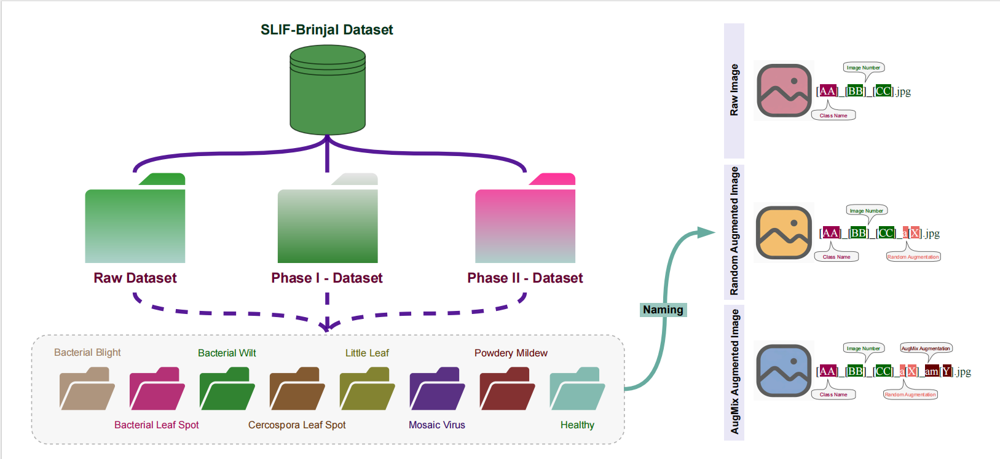

# SLIF-Brinjal: An In-Field Leaf Dataset for Disease Recognition


## Overview

SLIF-Brinjal (Sri Lanka In-Field Brinjal) is a comprehensive, field-acquired image collection containing **8,987 images** representing seven diseases and healthy leaves. The dataset was collected across multiple agro-climatic zones in Sri Lanka and includes realistic variations in background complexity, illumination, and leaf orientation.

**Official Dataset Link**: [Mendeley Data](https://data.mendeley.com/datasets/6yg6vktrc2/1)

<div style="display: flex; align-items: center; justify-content: space-between;">
  
  
</div>

### Diseases Represented

- Bacterial Blight
- Bacterial Leaf Spot
- Bacterial Wilt
- Cercospora Leaf Spot
- Littleleaf
- Mosaic Virus
- Powdery Mildew
- Healthy (Control)

<div style="display: flex; align-items: center; justify-content: space-between;">
  
  
</div>

## Repository Structure

```text
dataset/
├── src/                # Modular source code
│   ├── models.py       # UltraLightBlockNet_L1 architecture
│   ├── data.py         # Data loading and transforms
│   ├── engine.py       # Training and evaluation logic
│   └── utils.py        # plotting and saving utilities
├── main.py             # Main training script (CLI entry point)
├── requirements.txt    # Python dependencies
└── README.md           # Documentation
```

## Getting Started

### Prerequisites

Install the required dependencies:

```bash
pip install -r requirements.txt
```

### Training

Run the training script with configurable parameters:

```bash
python main.py --data_dir /path/to/data --batch_size 16 --epochs 100 --lr 1e-4
```

#### Arguments

- `--data_dir`: Directory containing the dataset images (Required).
- `--output_dir`: Directory to save logs and models (Default: 'output').
- `--batch_size`: Training batch size (Default: 16).
- `--epochs`: Number of training epochs (Default: 100).
- `--lr`: Learning rate (Default: 0.0001).
- `--num_folds`: Number of folds for cross-validation (Default: 5).
- `--model_type`: Model architecture (Choices: 'custom', 'mobilenet_v2', etc.).

## Model Architecture

The project utilizes **UltraLightBlockNet_L1**, a resource-efficient deep learning model designed for in-field deployment. It combines convolutional blocks with linear attention mechanisms to achieve high accuracy with minimal computational overhead.

## Citation

If you use this dataset or code in your research, please cite:

> George, R., et al. (2025). SLIF-Brinjal: An In-Field Leaf Dataset for Disease Recognition in Precision Agriculture.

---

Developed as part of the SLIF-Project.
